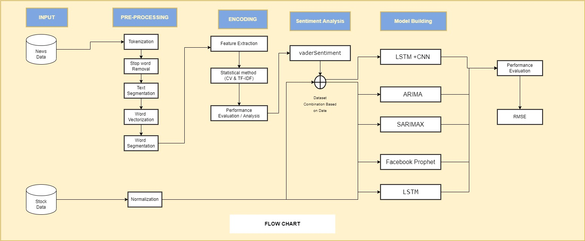

<!DOCTYPE html>
<html>
  <body style="text-align: justify; margin: 2%; user-select: none">
    

    <h1 style="text-align: center">
      Stock Prices Prediction Based on Social Influence & Historic Data
    </h1>
    

    

      <h2 style="text-align: center">Abstract</h2>
      

        Stock market price prediction is a challenging issue as it is impacted
        by a range of elements including political statements, economic
        circumstances, business market value, historical stock price, and so on.
        Hence study exhibit that many prebuild models like: ARIMA or deep
        learning model like:LSTM but their efficiency is not up to mark for
        stock price prediction . In this paper, we build hybrid model which is
        blended with CNN and LSTM to improve the performance. We used historical
        data (prior stock price) in the form of numerical information from of
        the NIFTY50 from 2015 to 2020, as well as news data in textual form from
        the @NDTVProfit twitter account. In addition, we used a variety of
        prebuild models and deep learning models to forecast the next 10 days'
        values. We initiated with numerals / historical dataset and applied
        ARIMA, SARIMAX, Facebook prophet and LSTM on historical datasts and we
        got error score 1062, 964, 709 and 285 respectively . In addition we
        applied all model like: ARIMA, SARIMAX, Facebook prophet and LSTM on
        combined dataset (historical datasts+news datasets) and obtained error
        score 789,655,380 and 170. The new hybrid model which is blended with
        CNN and LSTM deep learning models is applied on combined dataset and 89
        error score was obtained which is better as compared to all previous
        models.
      

      <h3>
        <i>
          Keywords :- Deep Learning, Stock Price, Lstm, Arima, Sarimax, Facebook
          Prophet, Rmse.
        </i>
      </h3>
      <h2 style="text-align: center">Introduction</h2>
      

        From past many years, analysts and scholars have been interested in
        predicting stock market values. Stock prices are difficult to anticipate
        because of their significant volatility, which is influenced by a
        variety of political and economic issues, as well as changes in
        leadership, investor attitude, and a variety of other factors. Stock
        price forecasting based only on historical data and textual information
        has shown to be ineffective. Investor views and mood about the overall
        financial markets, particularly specific sectors and assets, are
        measured by market sentiment. Hence Stock market price is a challenging
        issue and needs to be resolved in optimized way.
      

      

        For active traders and long-term investors, positive and negative
        emotion enhances price behaviour and generates trading and investing
        possibilities. According to existing sentiment research studies there is
        a high association between stock price swings and the release of news
        stories. Using machine learning and deep learning methods likes SVM,
        Naive Bayesian and LSTM, Sentiments analysis research have been done.
        The quantity of training data given determines the accuracy of the deep
        learning algorithm.
      

      

        In this work, two types of data has been collected data. First one is
        Textual or news data which was collected from twitter username
        @NDTVprofit and second one was numeric data or stock price data which
        was collected from NIFTY50 from 2015 to 2020. In addition, we cleaned
        and preprocessed our data then applied some prebuild model like:
        ARIMA,SARIMAX,Facebook Prophet on only numerical data and we got
        1062,964 and 709 error score respectively then we applied deep learning
        model LSTM and we got 285 error score then we applied all the models on
        combined dataset (numerical + textual) and we got 789,655,380 and 170
        respectively. Since the error score is not upto the mark, we build a new
        hybrid model which is combination of LSTM and CNN.The hybrid model is
        applied on combined dataset and 89 error score was obtained which is
        better as compared to all previous models. Contribution of this paper is
        improvement of the stock market prediction. We combined deep learning
        models LSTM and CNN as well as taking multiples learning rate , various
        activation and loss function to improve our model .The hybrid model
        exhibit good performance to the as compare to the previous models.
      

      <h2 style="text-align: center">Proposed model</h2>
      

        Predict stock prices using social history news data and a shared
        platform that comprises the five stages below and refer our model in
        figure 1: In the first stage, the dataset is scraped. The stock data
        comes from investing.com, while the news data comes from @NDTVProfit on
        Twitter. The data is then scrubbed and preprocessed. During the second
        stage Word tokenization, stopword deletion, text segmentation, word
        vectorization, and word segmentation are all applied to Twitter data.
        The data is normalised using inventory data.
      

      <ul>
        The procedure for cleaning data is as follows:
      </ul>
      <ul>
        Perform the following procedures to clean up a tweet:
      </ul>
      <ol type="1">
        <li>Make all of the letters lowercase.</li>
        <li>
          Remove any links from your website that begin with http,
          pic.twitter.com, or https.
        </li>
        <li>In your manuscript, remove all hashtags and @ symbols.</li>
        <li>
          Remove ETMarkets, ndtv, moneycontrol, market update, biznews,
          NewsAlert, and other similar phrases from the list.
        </li>
        <li>Remove all of the numbers</li>
      </ol>
      

        In the third step, features are extracted from the preprocessed text. A
        statistical model of text representation was used to extract features.In
        the fourth phase, VADER was used to do sentiment analysis on Twitter
        data. VADER is a wonderful choice since it performs well in this
        situation, particularly for social media messages.Phase 5 entails
        transmitting the processed data to several machine learning models as
        input.
      

      

        
      

      

      <h1 style="text-align: center">** Thank YOU **</h1>
      

    

  </body>
</html>
